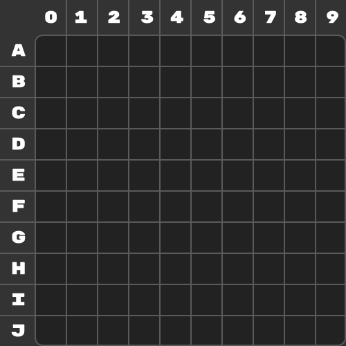

#  Pickzel Engine por Joaquin Larroca
## Creacion 6/3/2022 Uruguay

 

 

## 📂  **Varbiales del motor** / opciones y variables
 **Setting** _Es un objeto_
  - **GameName** _El nombre que se muestra en el Titulo_
  - **Debug** _Muestra una cuadricula e indicaciones para ella.Muestra el texto y el sonido donde se reproduce_
  - **debugTestImage** _Todas la imagenes del juego se remplazaran por una de prueba(facilita ver la rotacion de ella)_
  - **startScreen** _Segun el valor muestra una pantalla principal o no_
  - **audioVolume** _Es el volumen al cual se va a reproducir el sonido de la funcion playAudio() puede tener un valor entre 0.0 y 1_
  - **strangeValue** _Permite poner un valor de rotacion que no sea 0, 90, 180, 270, 360_
  - **forceMobileCTRLOnPC** _Permite usar los controles de telefono en la computadora con teclas ya asignadas_

 

- **A0** a **J9** _Desde A0 a J9. Es una valor de cada pixel.(Prueba el modo debug para ver los numeros y letras)_

 

## **Habilita el modo debug para ver esta cuadricula**

 

## 	📚 **Funciones personalizadas**
- **ScreenClear()** _Borra todos los pixeles y colores de la cuadricula_

 

- **setPixelColor(A0,"#fff")**  _Puede poner un pixel desde A0 hasta J9 sin comillas y seguido con una coma. El segundo valor es el color que puede tener un valor RGB, RGBA Y HEX. El valor de color tiene que estar entre comillas_

 

- **setPixelImage(A0,"assets/example.png",0,1)**  _Puede poner un pixel desde A0 hasta J9 sin comillas y seguido con una coma. El segundo valor es la ruta de la imagen EJ: "assets/example.png" . El valor de image tiene que estar entre comillas. El tercer valor es la rotacion puedes poner desde 0 a 360. Habilita el modo StrangeValues para no solo poder usar 0,90,180,270 y 360. El cuarto valor es para la opacidad entre 0 y 1. 0 es invisible y 1 es 100% visible_

 

- **playAudio(1,"assets/audio.wav",1)**  _El primer valor se le asigna al ID que puede ser del 1 al 5. sin comillas y seguido de una coma **(** Solo se puede reproducir 1 sonido por ID al mismo tiempo **)**.  El segundo es la ruta del archivo **.WAV**, **.MP3**, **.OGG**, **etc**. Tiene que estar entre comillas. El tercer valor es un numero que indica la velocidad de reproduccion puede ser entre 0 y 2, 1 siendo la velocidad por defecto_

 

- **stopAudio(1)**  _Para el audio que se esta reproduciendo en la ID del 1 al 5. sin comillas_

 

- **clearAudio()** _Para todos los sonidos_

 

- **showText("Hello",5)** _El primer valor se asigna al texto que se muestre. con comillas. El segundo valor para los segundos que se mostrara. Sin comillas_

 

- **showTexOnPixel(A0,"Hello")** _El primer valor es un Pixel. Y el segundo valor es el texto que se mostrara en el pixel, maximo 4 caracteres_

 

- **clearText()** _Borra el texto que se esta mostrando_

 

- **clearTextOnPixel(A0)** _El primer valor es el pixel. Borra el texto que se estaba mostrando en el pixel_

 

- **setText("Hello")** _El primer valor es el texto que se va a mostrar para siempre hasta que se borre usando **clearText()**_

 

- **whenKey("W","alert('Hello')")** _El primer valor puede ser una tecla, que este en **keyCodesList.txt**, tiene que ser uno de los que esta en la columna de IDENTIFIER y en MAYUSCULA. El segundo valor es el codigo que se va a ejecutar al apretar la tecla_

 

- **whenMouseOver("A0","alert('Hello')")** _El pixel tiene que estar entre comillas. EL segundo valor es el codigo que se va a ejecutar cuando el mouse esta arribe del pixel especificado_

 

- **whenMouseClick("A0","alert('Hello')")** _El pixel tiene que estar entre comillas. EL segundo valor es el codigo que se va a ejecutar cuando se haga click en el pixel especificado_

 

- **whenMobileKey("up","alert('Hello')")** _El primer valor puede ser una tecla, que este en **MobilekeyCodesList.txt**. El segundo valor es el codigo que se va a ejecutar al apretar la tecla en el teclado virtual y si la opcion forceMobileCTRLOnPC es true el teclado se podra usar para interactuar con el teclado virtual_

 

###### ❗CTRL+SHIFT+V =  VSCODE MD PREVIEW
